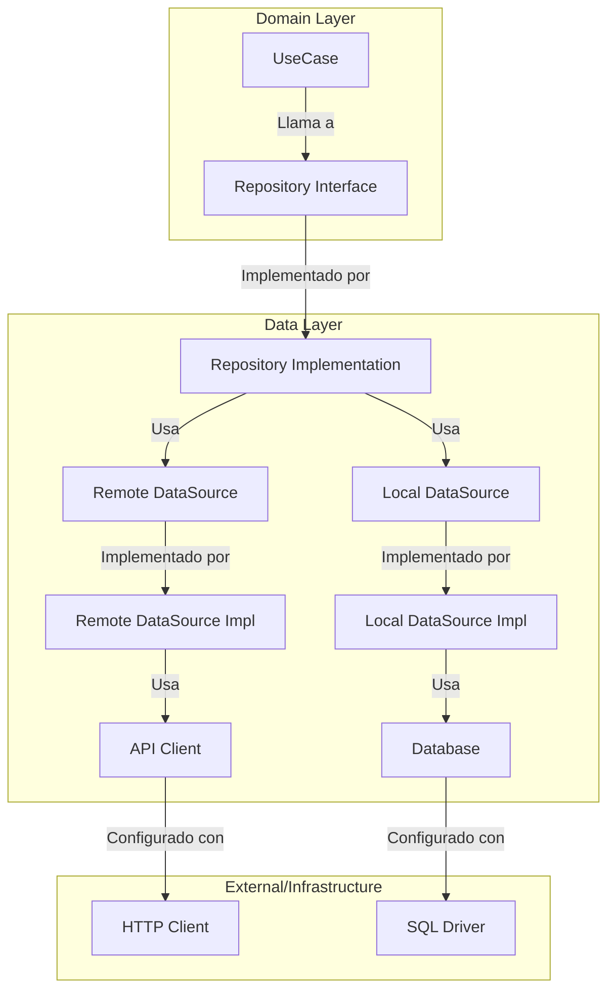

# Clean Architecture - La Capa de Datos (Data Layer)

## Introducción

Clean Architecture es un patrón arquitectónico que separa las preocupaciones del software en capas concéntricas. Una de las capas más importantes pero a menudo malentendida es la **Capa de Datos** (Data Layer).

## ¿Por qué existe la Capa de Datos?

La capa de datos existe para **aislar las reglas de negocio** de los detalles técnicos de cómo obtenemos y almacenamos los datos. En otras palabras, tu lógica de negocio no debe saber ni importarle si los datos vienen de:

- Una API REST
- Una base de datos local
- Un archivo JSON
- Un cache en memoria
- Un servicio GraphQL

## Estructura de la Capa de Datos

La capa de datos se compone de tres componentes principales:

```
data/
├── repositories/          # Implementación de los contratos del dominio
├── datasources/          # Abstracción de las fuentes de datos
└── network/             # Detalles técnicos de implementación
    (o external/, adapters/)
```

## Flujo de Datos y Responsabilidades

### 1. Repository (Repositorio)

**Ubicación**: `lib/src/features/post/data/repositories/post_repository_impl.dart`

```dart
@LazySingleton(as: PostRepository)
class PostRepositoryImpl implements PostRepository {
  final PostRemoteDataSource _remoteDataSource;

  PostRepositoryImpl(this._remoteDataSource);

  @override
  Future<List<Post>> getPosts() {
    return _remoteDataSource.getPosts();
  }
}
```

**Responsabilidades**:

- ✅ Implementar los contratos definidos en el dominio
- ✅ Orquestar múltiples fuentes de datos (remota + local)
- ✅ Implementar lógica de cache y sincronización
- ✅ Manejar errores y transformar excepciones técnicas en errores de dominio
- ❌ NO conocer detalles técnicos de HTTP, bases de datos, etc.

**¿Por qué existe?**
Porque el dominio define **QUÉ** necesita, pero no **CÓMO** obtenerlo. El Repository es el "QUÉ" implementado.

### 2. DataSource (Fuente de Datos)

**Ubicación**: `lib/src/features/post/data/datasources/post_remote_data_source.dart`

```dart
abstract class PostRemoteDataSource {
  Future<List<Post>> getPosts();
  Future<Post> getPostDetail(int id);
  Future<Post> createPost(Post post);
}

@LazySingleton(as: PostRemoteDataSource)
class PostRemoteDataSourceImpl implements PostRemoteDataSource {
  final ApiClient _apiClient;

  PostRemoteDataSourceImpl(this._apiClient);

  @override
  Future<List<Post>> getPosts() {
    return _apiClient.getPosts();
  }
}
```

**Responsabilidades**:

- ✅ Definir una interfaz abstracta para cada tipo de fuente de datos
- ✅ Convertir entre formatos (DTOs ↔ Entities)
- ✅ Manejar errores específicos de la fuente de datos
- ✅ Implementar lógica de retry, timeouts específicos
- ❌ NO conocer sobre lógica de negocio
- ❌ NO conocer sobre otros tipos de fuentes de datos

**¿Por qué existe?**
Porque necesitas poder **intercambiar** la implementación. Hoy usas una API REST, mañana podrías usar GraphQL, sin que el Repository lo sepa.

### 3. Network/External/Adapter (Detalles Técnicos)

**Ubicación**: `lib/src/features/post/data/network/api_client.dart`

```dart
@RestApi()
@lazySingleton
abstract class ApiClient {
  @factoryMethod
  factory ApiClient(Dio dio) = _ApiClient;

  @GET('/posts')
  Future<List<Post>> getPosts();

  @GET('/posts/{id}')
  Future<Post> getPostDetail(@Path('id') int id);

  @POST('/posts')
  Future<Post> createPost(@Body() Post post);
}
```

**Responsabilidades**:

- ✅ Implementar los detalles técnicos específicos (HTTP, SQL, etc.)
- ✅ Manejar serialización/deserialización
- ✅ Configurar headers, autenticación, etc.
- ✅ Manejar errores específicos del protocolo/tecnología
- ❌ NO conocer sobre lógica de negocio
- ❌ NO conocer sobre otros componentes del sistema

**¿Por qué existe?**
Porque los detalles técnicos cambian constantemente. Retrofit hoy, Dio mañana, HTTP/2 pasado mañana.

## Diagrama de Flujo



## Ejemplo Práctico: Agregando Cache

Imagina que quieres agregar cache a tu aplicación:

### Sin Clean Architecture (❌ Malo):

```dart
// En tu UI directamente
class PostPage extends StatefulWidget {
  Future<List<Post>> getPosts() async {
    // Lógica de cache mezclada con HTTP
    if (cacheIsValid()) {
      return await storage.getPosts();
    } else {
      final posts = await http.get('/posts');
      await storage.savePosts(posts);
      return posts;
    }
  }
}
```

### Con Clean Architecture (✅ Bueno):

```dart
// Repository orchestrates múltiples fuentes
class PostRepositoryImpl implements PostRepository {
  final PostRemoteDataSource _remote;
  final PostLocalDataSource _local;

  @override
  Future<List<Post>> getPosts() async {
    try {
      // Intenta obtener datos locales primero
      final localPosts = await _local.getPosts();
      if (localPosts.isNotEmpty && !_isCacheExpired()) {
        return localPosts;
      }

      // Si no hay cache válido, obtiene de remoto
      final remotePosts = await _remote.getPosts();

      // Guarda en cache para próximas consultas
      await _local.savePosts(remotePosts);

      return remotePosts;
    } catch (e) {
      // Si falla remoto, devuelve cache aunque esté expirado
      return await _local.getPosts();
    }
  }
}
```

## Beneficios de Esta Estructura

### 1. **Testabilidad**

```dart
// Puedes testear cada capa independientemente
class MockPostRemoteDataSource extends Mock implements PostRemoteDataSource {}

void main() {
  test('Repository returns cached data when available', () async {
    final mockRemote = MockPostRemoteDataSource();
    final mockLocal = MockPostLocalDataSource();

    when(mockLocal.getPosts()).thenAnswer((_) async => [testPost]);

    final repository = PostRepositoryImpl(mockRemote, mockLocal);
    final result = await repository.getPosts();

    expect(result, equals([testPost]));
    verifyNever(mockRemote.getPosts()); // No llamó a remoto
  });
}
```

### 2. **Intercambiabilidad**

```dart
// Puedes cambiar de REST a GraphQL sin tocar el Repository
@LazySingleton(as: PostRemoteDataSource)
class PostGraphQLDataSource implements PostRemoteDataSource {
  final GraphQLClient _client;

  @override
  Future<List<Post>> getPosts() async {
    final result = await _client.query(GetPostsQuery());
    return result.data.posts.map((gql) => Post.fromGraphQL(gql)).toList();
  }
}
```

### 3. **Manejo de Errores Específico**

```dart
class PostRemoteDataSourceImpl implements PostRemoteDataSource {
  @override
  Future<List<Post>> getPosts() async {
    try {
      return await _apiClient.getPosts();
    } on DioException catch (e) {
      if (e.response?.statusCode == 401) {
        throw UnauthorizedException();
      } else if (e.response?.statusCode == 500) {
        throw ServerException();
      }
      throw NetworkException();
    }
  }
}
```

## Nomenclatura Según Clean Architecture

Diferentes implementaciones de Clean Architecture usan diferentes nombres:

- **network/**: Común en Android/Flutter
- **external/**: Usado en backend/Node.js
- **adapters/**: Nombre más formal de Clean Architecture
- **infrastructure/**: Usado en DDD (Domain-Driven Design)

Todos son válidos. Lo importante es la **separación de responsabilidades**.

## Recomendaciones para tu Proyecto

### Estructura Actual:

```
data/
├── repositories/
├── datasources/
└── network/
```

### Estructura Recomendada:

```
data/
├── repositories/
├── datasources/
└── models/          # DTOs específicos de la API
```

**Razón**: El `ApiClient` es más específico a la fuente de datos remota, por lo que puede vivir junto al `PostRemoteDataSource`.

## Conclusión

La capa de datos en Clean Architecture puede parecer excesiva al principio, pero su valor se ve cuando:

1. **Necesitas cambiar de API** (de REST a GraphQL)
2. **Agregas cache** (local storage)
3. **Manejas offline** (sincronización)
4. **Escribes tests** (mocks y stubs)
5. **Trabajas en equipo** (cada desarrollador puede trabajar en una capa)

La regla de oro es: **Cada capa debe saber lo mínimo necesario para hacer su trabajo**.

---

_Documento creado para el proyecto BlueBank App - Clean Architecture Data Layer_
